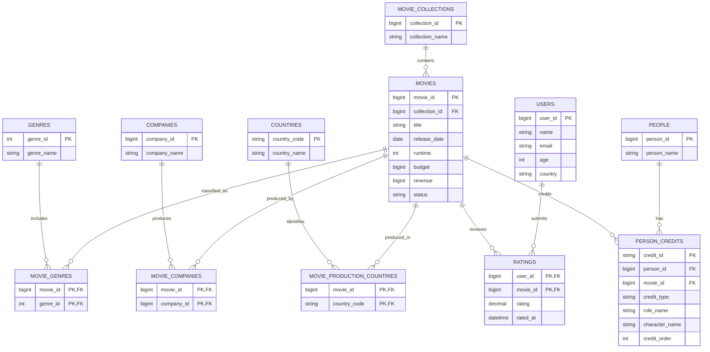

# Kiến trúc Collection MongoDB cho The Movies Dataset

## 1. Mục tiêu thiết kế

Thiết kế này sử dụng cách tiếp cận **query-first**, nghĩa là cấu trúc collection được xây dựng dựa trên các nhu cầu khai thác dữ liệu thực tế thay vì chuyển trực tiếp từng bảng trong ERD thành một collection.

Thiết kế chấp nhận lặp dữ liệu có chủ đích để giảm số lần truy vấn chéo giữa các collection. Tuy nhiên, mỗi nhóm dữ liệu vẫn phải có một nguồn chính để tránh mất kiểm soát khi cập nhật.

Hệ thống được thiết kế để hỗ trợ các nhu cầu chính như xếp hạng phim theo thể loại và điểm đánh giá, thống kê sự nghiệp diễn viên hoặc đạo diễn, phân tích hành vi đánh giá theo quốc gia và nhóm tuổi, cũng như đánh giá hiệu quả đầu tư của công ty sản xuất theo thể loại phim.

---

# 2. Kiến trúc ERD trước khi chuyển sang MongoDB

## 2.1. Mục đích của ERD

ERD dưới đây là mô hình logic chuẩn hóa của miền dữ liệu phim. Mô hình này được dùng làm điểm xuất phát để xác định thực thể, khóa và quan hệ; hệ thống không triển khai một cơ sở dữ liệu quan hệ song song.

Khi chuyển sang MongoDB, thiết kế không ánh xạ máy móc mỗi bảng thành một collection. Các quan hệ được embed, reference hoặc materialize tùy theo sáu nhu cầu khai thác. Đây là điểm khác biệt chính giữa mô hình ERD chuẩn hóa và thiết kế document theo hướng query-first.

## 2.2. ERD logic



## 2.3. Ánh xạ ERD sang MongoDB theo query-first

| Thành phần ERD | Cách biểu diễn trong MongoDB | Quyết định thiết kế | Nhu cầu hỗ trợ |
|---|---|---|---|
| `MOVIES` | `movies` | Collection trung tâm, giữ dữ liệu chuẩn của phim | Q1 và dữ liệu nền cho Q2-Q6 |
| `MOVIE_COLLECTIONS` | `movieCollections` và snapshot `movies.collection` | Reference bằng ObjectId, đồng thời embed tên để đọc phim không cần lookup | Hiển thị chi tiết phim |
| `GENRES` + `MOVIE_GENRES` | `genres` và mảng `movies.genres[]` | Bảng nối nhiều-nhiều được thay bằng mảng embedded | Q1 lọc/xếp hạng phim theo thể loại |
| `COMPANIES` + `MOVIE_COMPANIES` | `companies`, `movies.companies[]`, `companyMovies` | Embed ở chiều phim; materialize chiều công ty → phim | Q6 phân tích đầu tư theo công ty |
| `COUNTRIES` + `MOVIE_PRODUCTION_COUNTRIES` | `movies.productionCountries[]` | Dữ liệu nhỏ, luôn đọc cùng phim nên embed | Thông tin phim theo quốc gia sản xuất |
| `USERS` | `users` | Collection nguồn chính; `ageGroup` được tính sẵn | Q4 và Q5 |
| `RATINGS` | `ratings` | Reference tới user/phim; embed snapshot quốc gia, nhóm tuổi và thể loại | Q1, Q4 và Q5 không cần nhiều `$lookup` |
| `PEOPLE` | `people` | Collection nguồn người, có `careerStats` tổng hợp | Q3 xếp hạng Actor/Director |
| `PERSON_CREDITS` | `personCredits` | Thay bảng nối người-phim-vai trò; lặp tên và thống kê phim có chủ đích | Q2 và Q3 |
| Tổng hợp nhân khẩu học | `demographicGenreStats` | Materialized aggregation từ `ratings` | Q4 |
| Tổng hợp công ty-thể loại | `companyGenreStats` | Materialized aggregation từ `companyMovies` | Q6 |

## 2.4. Mapping theo sáu truy vấn

| Truy vấn | Quan hệ cần join trong ERD | Cách MongoDB tránh hoặc giảm join |
|---|---|---|
| Q1 Top phim theo thể loại | `MOVIES → MOVIE_GENRES → GENRES → RATINGS` | Genre và `ratingStats` được embed trong `movies` |
| Q2 Sự nghiệp cá nhân | `PEOPLE → PERSON_CREDITS → MOVIES` | `personCredits` chứa snapshot tên phim, vai trò và doanh thu |
| Q3 Actor/Director nhiều phim | Group `PERSON_CREDITS` theo người và vai trò, join ratings | `people.careerStats` được materialize trước |
| Q4 Thể loại cao nhất theo nhân khẩu học | `USERS → RATINGS → MOVIES → MOVIE_GENRES` | Snapshot nằm trong rating và kết quả được materialize vào `demographicGenreStats` |
| Q5 Quốc gia → nhóm tuổi | Cùng chuỗi join như Q4, thêm subtotal | Một lần scan ratings theo `movieSnapshot.genres`, sau đó dùng `$facet` |
| Q6 Hiệu quả công ty theo thể loại | `COMPANIES → MOVIE_COMPANIES → MOVIES → MOVIE_GENRES` | `companyMovies` đảo chiều truy vấn và `companyGenreStats` lưu tổng hợp |

Việc lặp dữ liệu trong MongoDB vì vậy là kết quả của việc tối ưu đường đọc từ ERD, không phải lặp tùy ý. Các collection dẫn xuất luôn có thể tái tạo từ collection nguồn.

---

# 3. Tổng quan collection MongoDB

## 3.1. Danh sách collection

Thiết kế gồm 11 collection:

```text
1. movies
2. movieCollections
3. users
4. ratings
5. people
6. personCredits
7. genres
8. companies
9. companyMovies
10. demographicGenreStats
11. companyGenreStats
```

Trong đó, 8 collection đầu là collection dữ liệu chính, `companyMovies` là collection tối ưu cho truy vấn theo công ty, còn `demographicGenreStats` và `companyGenreStats` là collection tổng hợp phục vụ báo cáo.

---

## 3.2. Nguồn dữ liệu chính

| Nhóm dữ liệu                              | Collection nguồn chính  |
| ----------------------------------------- | ----------------------- |
| Thông tin phim                            | `movies`                |
| Bộ phim                                   | `movieCollections`      |
| Người dùng                                | `users`                 |
| Đánh giá chi tiết                         | `ratings`               |
| Cá nhân tham gia phim                     | `people`                |
| Vai trò của cá nhân trong phim            | `personCredits`         |
| Danh mục thể loại                         | `genres`                |
| Danh mục công ty sản xuất                 | `companies`             |
| Quan hệ công ty và phim phục vụ phân tích | `companyMovies`         |
| Thống kê người dùng theo thể loại         | `demographicGenreStats` |
| Thống kê công ty theo thể loại            | `companyGenreStats`     |

Các giá trị như tên thể loại, tên công ty, tên phim hoặc thống kê điểm số có thể được lặp lại ở collection khác để tăng tốc độ đọc. Khi đó, collection nguồn chính vẫn là nơi quản lý dữ liệu chuẩn.

---

# 4. Thiết kế chi tiết

Mọi collection nhập từ dataset giữ ID nguồn trong `sourceIds`. MongoDB `_id` được dùng cho quan hệ nội bộ, còn ID TMDB/MovieLens/IMDb dùng để truy vết, ánh xạ ETL và chống nhập trùng.

## 4.1. Collection `movieCollections`

Collection này lưu các bộ hoặc chuỗi phim.

```javascript
{
  _id: ObjectId("..."),
  sourceIds: { tmdbId: 10194 },
  collectionName: "The Dark Knight Collection",

  createdAt: ISODate("2026-01-01T00:00:00Z"),
  updatedAt: ISODate("2026-01-01T00:00:00Z")
}
```

Một bộ phim có thể chứa nhiều phim. Một phim có thể không thuộc bộ phim nào.

Index đề xuất:

```javascript
db.movieCollections.createIndex({ collectionName: 1 }, { unique: true });
db.movieCollections.createIndex({ "sourceIds.tmdbId": 1 }, { unique: true });
```

---

## 4.2. Collection `genres`

Collection này lưu danh mục thể loại chuẩn.

```javascript
{
  _id: ObjectId("..."),
  sourceIds: { tmdbId: 28 },
  genreName: "Action",

  createdAt: ISODate("2026-01-01T00:00:00Z"),
  updatedAt: ISODate("2026-01-01T00:00:00Z")
}
```

Collection này giúp tránh tình trạng cùng một thể loại nhưng có nhiều cách ghi khác nhau.

Index đề xuất:

```javascript
db.genres.createIndex({ genreName: 1 }, { unique: true });
db.genres.createIndex({ "sourceIds.tmdbId": 1 }, { unique: true });
```

---

## 4.3. Collection `companies`

Collection này lưu danh mục công ty sản xuất và một số chỉ số tổng hợp.

```javascript
{
  _id: ObjectId("..."),
  sourceIds: { tmdbId: 6194 },
  companyName: "Warner Bros.",

  companyStats: {
    movieCount: 850,
    totalBudget: NumberLong("18000000000"),
    totalRevenue: NumberLong("45000000000"),
    revenueBudgetRatio: 2.5
  },

  createdAt: ISODate("2026-01-01T00:00:00Z"),
  updatedAt: ISODate("2026-01-01T00:00:00Z"),
  statsUpdatedAt: ISODate("2026-01-01T00:00:00Z")
}
```

`companyStats` là dữ liệu tổng hợp, có thể cập nhật định kỳ.

Index đề xuất:

```javascript
db.companies.createIndex({ "sourceIds.tmdbId": 1 }, { unique: true });
db.companies.createIndex({ companyName: 1 });

db.companies.createIndex({
  "companyStats.totalRevenue": -1,
  "companyStats.revenueBudgetRatio": -1,
});
```

---

## 4.4. Collection `movies`

Đây là collection trung tâm của hệ thống.

```javascript
{
  _id: ObjectId("..."),

  sourceIds: {
    tmdbId: 155,
    movieLensId: 58559,
    imdbId: "tt0468569"
  },

  title: "The Dark Knight",
  overview: "Batman faces a criminal mastermind...",
  releaseDate: ISODate("2008-07-18T00:00:00Z"),
  runtime: 152,
  status: "Released",

  budget: NumberLong("185000000"),
  revenue: NumberLong("1004558444"),
  productionCountries: [
    {
      countryCode: "US",
      countryName: "United States of America"
    }
  ],

  collection: {
    collectionId: ObjectId("..."),
    collectionName: "The Dark Knight Collection"
  },

  genres: [
    {
      genreId: ObjectId("..."),
      genreName: "Action"
    },
    {
      genreId: ObjectId("..."),
      genreName: "Crime"
    }
  ],

  companies: [
    {
      companyId: ObjectId("..."),
      companyName: "Warner Bros."
    },
    {
      companyId: ObjectId("..."),
      companyName: "Legendary Pictures"
    }
  ],

  ratingStats: {
    ratingCount: 125000,
    averageRating: 4.42
  },

  sourceRatingStats: {
    ratingCount: 12269,
    averageRating: 8.3
  },

  createdAt: ISODate("2026-01-01T00:00:00Z"),
  updatedAt: ISODate("2026-01-01T00:00:00Z"),
  ratingStatsUpdatedAt: ISODate("2026-01-01T00:00:00Z")
}
```

`genres`, `companies` và `collection` được nhúng trực tiếp vì thường được truy xuất cùng phim.

`ratingStats` được tính từ `ratings_small.csv` thông qua collection `ratings`. `sourceRatingStats` giữ `vote_average` và `vote_count` từ metadata TMDB; hai thang điểm không được trộn lẫn.

Index đề xuất:

```javascript
db.movies.createIndex({ title: 1 });

db.movies.createIndex({ "sourceIds.tmdbId": 1 }, { unique: true });
db.movies.createIndex({ "sourceIds.movieLensId": 1 }, { unique: true, sparse: true });

db.movies.createIndex({
  "genres.genreId": 1,
  "ratingStats.ratingCount": -1,
  "ratingStats.averageRating": -1,
});

db.movies.createIndex({ "companies.companyId": 1 });

db.movies.createIndex({ "collection.collectionId": 1 });

db.movies.createIndex({
  "genres.genreName": 1,
  "ratingStats.averageRating": -1,
  "ratingStats.ratingCount": -1,
});
```

---

## 4.5. Collection `users`

Collection này lưu thông tin người dùng.

```javascript
{
  _id: ObjectId("..."),

  sourceIds: { movieLensUserId: 1 },

  name: "Nguyen Van A",
  email: "vana@example.com",
  age: 27,
  ageGroup: "25-34",
  country: "Vietnam",
  isSynthetic: true,

  createdAt: ISODate("2026-01-01T00:00:00Z"),
  updatedAt: ISODate("2026-01-01T00:00:00Z")
}
```

Các nhóm tuổi nên được thống nhất:

```text
Under 18
18-24
25-34
35-44
45-54
55+
```

Index đề xuất:

```javascript
db.users.createIndex({ email: 1 }, { unique: true });

db.users.createIndex({
  country: 1,
  ageGroup: 1,
});
```

---

## 4.6. Collection `ratings`

Mỗi document là một đánh giá của một người dùng cho một phim.

```javascript
{
  _id: ObjectId("..."),

  userId: ObjectId("..."),
  movieId: ObjectId("..."),

  sourceIds: {
    movieLensUserId: 1,
    movieLensMovieId: 31
  },

  rating: 4.5,
  ratedAt: ISODate("2026-07-20T10:30:00Z"),

  userSnapshot: {
    country: "Vietnam",
    ageGroup: "25-34"
  },

  movieSnapshot: {
    genres: [
      {
        genreId: ObjectId("..."),
        genreName: "Action"
      },
      {
        genreId: ObjectId("..."),
        genreName: "Crime"
      }
    ]
  },

  createdAt: ISODate("2026-07-20T10:30:00Z"),
  updatedAt: ISODate("2026-07-20T10:30:00Z")
}
```

`userSnapshot` và `movieSnapshot` giúp chạy báo cáo theo quốc gia, nhóm tuổi và thể loại mà không phải liên kết nhiều collection.

Index đề xuất:

```javascript
db.ratings.createIndex(
  {
    userId: 1,
    movieId: 1,
  },
  {
    unique: true,
  },
);

db.ratings.createIndex({
  movieId: 1,
  ratedAt: -1,
});

db.ratings.createIndex({ "movieSnapshot.genres.genreName": 1 });

db.ratings.createIndex({
  userId: 1,
  ratedAt: -1,
});

db.ratings.createIndex({
  "userSnapshot.country": 1,
  "userSnapshot.ageGroup": 1,
  "movieSnapshot.genres.genreId": 1,
});
```

---

## 4.7. Collection `people`

Collection này lưu danh mục cá nhân và thống kê sự nghiệp.

```javascript
{
  _id: ObjectId("..."),

  sourceIds: { tmdbId: 525 },

  personName: "Christopher Nolan",

  careerStats: {
    movieCount: 12,
    actorMovieCount: 0,
    directorMovieCount: 12,
    totalRevenue: NumberLong("6200000000"),
    averageMovieRating: 4.21,
    actorAverageMovieRating: null,
    directorAverageMovieRating: 4.21
  },

  createdAt: ISODate("2026-01-01T00:00:00Z"),
  updatedAt: ISODate("2026-01-01T00:00:00Z"),
  statsUpdatedAt: ISODate("2026-01-01T00:00:00Z")
}
```

Không nên đặt `personName` là duy nhất vì có thể tồn tại nhiều người cùng tên.

Index đề xuất:

```javascript
db.people.createIndex({ personName: 1 });

db.people.createIndex({
  "careerStats.movieCount": -1,
  "careerStats.averageMovieRating": -1,
});

db.people.createIndex({
  "careerStats.actorMovieCount": -1,
  "careerStats.actorAverageMovieRating": -1,
});

db.people.createIndex({
  "careerStats.directorMovieCount": -1,
  "careerStats.directorAverageMovieRating": -1,
});
```

---

## 4.8. Collection `personCredits`

Mỗi document thể hiện một vai trò của một người trong một phim.

```javascript
{
  _id: ObjectId("..."),

  sourceIds: { creditId: "52fe4781c3a36847f81398c3" },

  personId: ObjectId("..."),
  personName: "Christopher Nolan",

  movieId: ObjectId("..."),
  movieTitle: "The Dark Knight",

  creditType: "CREW",
  roleName: "Director",
  department: "Directing",

  characterName: null,
  creditOrder: null,

  movieStats: {
    revenue: NumberLong("1004558444"),
    averageRating: 4.42,
    ratingCount: 125000
  },

  createdAt: ISODate("2026-01-01T00:00:00Z"),
  updatedAt: ISODate("2026-01-01T00:00:00Z")
}
```

Ví dụ với diễn viên:

```javascript
{
  personId: ObjectId("..."),
  personName: "Christian Bale",

  movieId: ObjectId("..."),
  movieTitle: "The Dark Knight",

  creditType: "CAST",
  roleName: "Actor",
  department: "Acting",

  characterName: "Bruce Wayne / Batman",
  creditOrder: 0,

  movieStats: {
    revenue: NumberLong("1004558444"),
    averageRating: 4.42,
    ratingCount: 125000
  }
}
```

Index đề xuất:

```javascript
db.personCredits.createIndex({
  personId: 1,
  roleName: 1,
  movieId: 1,
});

db.personCredits.createIndex({
  personName: 1,
  roleName: 1,
});

db.personCredits.createIndex({
  movieId: 1,
  creditOrder: 1,
});

db.personCredits.createIndex({ "sourceIds.creditId": 1 }, { unique: true });
```

---

## 4.9. Collection `companyMovies`

Collection này tối ưu cho các truy vấn bắt đầu từ công ty sản xuất.

```javascript
{
  _id: ObjectId("..."),

  companyId: ObjectId("..."),
  companyName: "Warner Bros.",

  movieId: ObjectId("..."),
  movieTitle: "The Dark Knight",

  financials: {
    budget: NumberLong("185000000"),
    revenue: NumberLong("1004558444"),
    revenueBudgetRatio: 5.43
  },

  genres: [
    {
      genreId: ObjectId("..."),
      genreName: "Action"
    },
    {
      genreId: ObjectId("..."),
      genreName: "Crime"
    }
  ],

  ratingStats: {
    ratingCount: 125000,
    averageRating: 4.42
  },

  createdAt: ISODate("2026-01-01T00:00:00Z"),
  updatedAt: ISODate("2026-01-01T00:00:00Z")
}
```

Một phim có nhiều công ty sẽ tạo nhiều document trong `companyMovies`.

Do dữ liệu gốc không cho biết doanh thu thực tế được chia cho từng công ty như thế nào, trường `revenue` được hiểu là doanh thu của phim mà công ty có tham gia sản xuất.

Index đề xuất:

```javascript
db.companyMovies.createIndex(
  {
    companyId: 1,
    movieId: 1,
  },
  {
    unique: true,
  },
);

db.companyMovies.createIndex({
  companyId: 1,
  "genres.genreId": 1,
});

db.companyMovies.createIndex({
  "financials.revenue": -1,
  "financials.revenueBudgetRatio": -1,
});
```

---

## 4.10. Collection `demographicGenreStats`

Collection này lưu kết quả tổng hợp theo thể loại, quốc gia và nhóm tuổi.

```javascript
{
  _id: ObjectId("..."),

  genreId: ObjectId("..."),
  genreName: "Action",

  country: "Vietnam",
  ageGroup: "25-34",

  ratingCount: 15200,
  averageRating: 4.12,

  calculatedAt: ISODate("2026-07-21T00:00:00Z")
}
```

Mỗi document đại diện cho một tổ hợp:

```text
Genre + Country + AgeGroup
```

Index đề xuất:

```javascript
db.demographicGenreStats.createIndex(
  {
    genreId: 1,
    country: 1,
    ageGroup: 1,
  },
  {
    unique: true,
  },
);

db.demographicGenreStats.createIndex({
  country: 1,
  ageGroup: 1,
  averageRating: -1,
});
```

---

## 4.11. Collection `companyGenreStats`

Collection này lưu kết quả tổng hợp theo công ty và thể loại.

```javascript
{
  _id: ObjectId("..."),

  companyId: ObjectId("..."),
  companyName: "Warner Bros.",

  genreId: ObjectId("..."),
  genreName: "Action",

  movieCount: 120,

  totalBudget: NumberLong("3500000000"),
  totalRevenue: NumberLong("9200000000"),

  averageMovieRevenueBudgetRatio: 3.15,
  overallRevenueBudgetRatio: 2.63,

  calculatedAt: ISODate("2026-07-21T00:00:00Z")
}
```

`averageMovieRevenueBudgetRatio` là trung bình tỷ lệ Revenue/Budget của từng phim.

`overallRevenueBudgetRatio` được tính bằng tổng Revenue chia tổng Budget và nên được dùng để xếp hạng công ty.

Index đề xuất:

```javascript
db.companyGenreStats.createIndex(
  {
    companyId: 1,
    genreId: 1,
  },
  {
    unique: true,
  },
);

db.companyGenreStats.createIndex({
  totalRevenue: -1,
  overallRevenueBudgetRatio: -1,
});
```

---

# 5. Quan hệ logic giữa các collection

```text
movieCollections
    └── movies

genres
    └── movies.genres
    └── ratings.movieSnapshot.genres
    └── companyMovies.genres
    └── demographicGenreStats
    └── companyGenreStats

companies
    └── movies.companies
    └── companyMovies
    └── companyGenreStats

users
    └── ratings

movies
    └── ratings
    └── personCredits
    └── companyMovies

people
    └── personCredits
```

---

# 6. Collection gốc và collection dẫn xuất

## Collection gốc

```text
movieCollections
genres
companies
movies
users
ratings
people
personCredits
```

## Collection tối ưu truy vấn

```text
companyMovies
```

## Collection tổng hợp

```text
demographicGenreStats
companyGenreStats
```

`companyMovies` có thể được tái tạo từ `movies`, nhưng được giữ lại để tăng tốc các truy vấn theo công ty.

`demographicGenreStats` và `companyGenreStats` có thể được xóa và tạo lại từ dữ liệu gốc.

---

# 7. Quy tắc đồng bộ

Khi thông tin phim thay đổi, cần cập nhật `movies`, `companyMovies` và các snapshot liên quan.

Khi một đánh giá được thêm, sửa hoặc xóa, cần cập nhật `ratings` trước. Các trường thống kê trong `movies`, `people`, `personCredits`, `companyMovies`, `demographicGenreStats` và `companyGenreStats` có thể được cập nhật sau bằng cron job.

Khi đổi tên thể loại, công ty hoặc bộ phim, cần cập nhật collection nguồn chính và các bản sao đang được nhúng.

Ví dụ đổi tên thể loại:

```text
genres
movies.genres
ratings.movieSnapshot.genres
companyMovies.genres
demographicGenreStats
companyGenreStats
```

---

# 8. Chiến lược cập nhật đề xuất

```text
Cập nhật ngay:
- movies
- users
- ratings
- people
- personCredits
- genres
- companies
- movieCollections

Cập nhật theo batch hoặc cron:
- movies.ratingStats
- people.careerStats
- companies.companyStats
- companyMovies.ratingStats
- demographicGenreStats
- companyGenreStats
```

Khuyến nghị: (cái này không cần làm)

```text
Mỗi giờ:
- cập nhật movies.ratingStats

Mỗi ngày:
- cập nhật people.careerStats
- cập nhật companies.companyStats
- làm mới demographicGenreStats
- làm mới companyGenreStats
```

---

# 9. Lưu ý dữ liệu

Dữ liệu `name`, `email`, `age` và `country` của người dùng không có sẵn đầy đủ trong bộ dữ liệu MovieLens gốc. Cần bổ sung từ nguồn khác hoặc tạo dữ liệu mẫu.

Một phim có thể thuộc nhiều thể loại. Khi tính doanh thu theo thể loại, toàn bộ doanh thu phim có thể được tính cho từng thể loại mà phim thuộc về. Vì vậy không nên cộng tổng doanh thu giữa các thể loại để suy ra doanh thu toàn hệ thống.

Một phim có thể có nhiều công ty sản xuất. Doanh thu trong báo cáo công ty phản ánh doanh thu của các phim mà công ty tham gia, không phải doanh thu thực nhận của từng công ty.

Một người có thể có nhiều vai trò trong cùng một phim. Khi tính tổng doanh thu sự nghiệp, doanh thu của một phim chỉ nên được tính một lần cho mỗi người.

---

# 10. Kết luận

Kiến trúc cuối cùng gồm 11 collection:

```text
movies
movieCollections
users
ratings
people
personCredits
genres
companies
companyMovies
demographicGenreStats
companyGenreStats
```

Thiết kế này đáp ứng đầy đủ dữ liệu từ ERD, đồng thời tối ưu cho các nhu cầu truy vấn đã chọn. Việc lặp dữ liệu được chấp nhận có chủ đích theo hướng query-first, với điều kiện mỗi nhóm dữ liệu có nguồn chính và quy trình đồng bộ rõ ràng.
